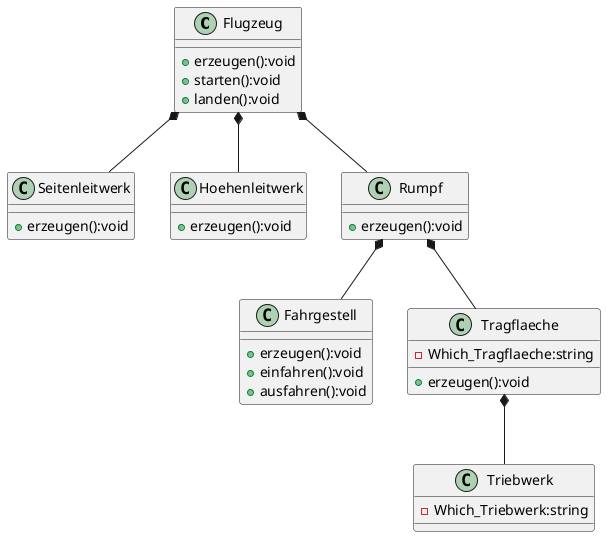

- Flugzeugbestandteile  
- PlantUML 

```plantuml
@startuml Flugzeug

class Flugzeug
{
    + erzeugen():void
    + starten():void
    + landen():void
}

class Seitenleitwerk
{
    + erzeugen():void
}

class Hoehenleitwerk
{
    + erzeugen():void
}

class Rumpf{
    + erzeugen():void
}

Flugzeug *-- Seitenleitwerk
Flugzeug *-- Hoehenleitwerk
Flugzeug *-- Rumpf

class Fahrgestell
{
    + erzeugen():void 
    + einfahren():void 
    + ausfahren():void 
}

Rumpf *-- Fahrgestell 

class Tragflaeche
{
    + erzeugen():void 
    - Which_Tragflaeche:string
}

Rumpf *-- Tragflaeche

class Triebwerk
{
    - Which_Triebwerk:string
}

Tragflaeche *-- Triebwerk
@enduml
```
