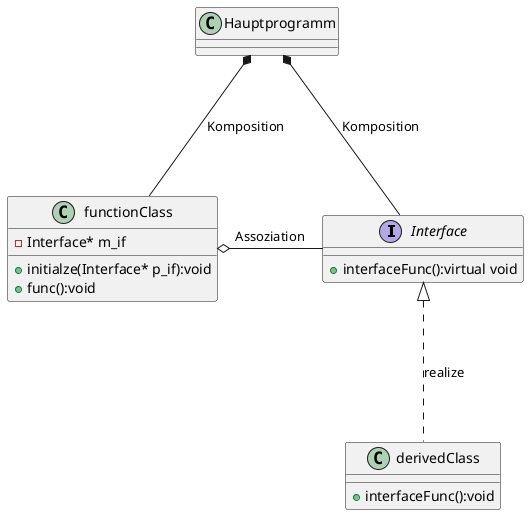

	UML-Diagramm


Interface
```C++
#include <iostream>

class Interface{
public:
    virtual ~Interface(){
    
    }
    
    virtual void interfaceFunc() = 0;

};
```

derivedClass
```C++
#include "interface.h"

#include <iostream>

class derivedClass:public Interface
{
public:
    ~derivedClass(){

    }

    void interfaceFunc(){
        std::cout<<"This is implementation of Function from interface\n";
    }
};
```

functionClass
```C++
#include "interface.h"

class functionClass{
public:
    functionClass(){

    }
    
    void initialze(Interface* p_if){
        m_if = p_if;
    }

    void func(){
        m_if->interfaceFunc();
    }
    
protected:

private:
    Interface* m_if;
};
```

main
```C++
#include "interface.h"
#include "derivedclass.h"
#include "functionclass.h"

#include <iostream>

derivedClass dc;
functionClass fc;

int main()

{
    fc.initialze(&dc);
    fc.func();
    return 0;
}
```
