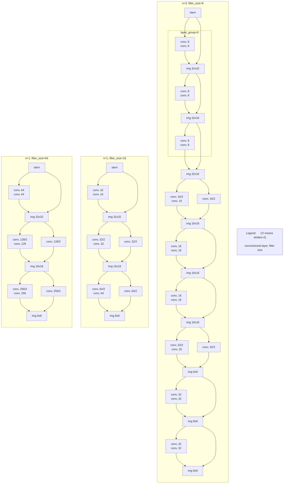

#### 1\. Nachvollziehen der Schritte im Jupyter Notebook zum ResNet

##### 1\.1 Analysieren sie die Ergebnisse für die Modelle 1 und 2.

* 1 Modell: max=72% und großes Overfitting
* 2 Modell (mit learning rate Veränderung): max zwar 86%, also deutlich besser als 1. Modell, dafür ist ab 11 Epochen keine Verbesserung mehr zu sehen, weil die Trainings-Genauigkeit 100% erreicht hat

##### 1\.2 Analysieren sie die Funktion: def ResidualBlocks(x, stack_n, filter_size)

* **Input:**
  * x: aktueller / bisherige Layer
  * stack_n: Anzahl residual Blöcke pro image size / feature map size
  * filter_size: Anzahl Kanäle am Anfang von Residual Blöcken
* **Output:**
  * bisherige Layer + Risidual Blöcke hinzugefügt

##### 1\.3 visualisieren sie das Verhalten der Funktion für 3 verschiedene Parametersätze, z. B. stack_n = 1, filter_size = 16 oder stack_n = 3, filter_size = 8

|  | n | 2n | 6n | 3n | filter_size |
|--|---|----|----|----|-------------|
|  | blocks per img size | layers per img size | layers in total | shortcuts / residual blocks in total | Anzahl Kanäle |
| **Beispiele** | 1<br />3 | 2<br />6 | 6<br />18 | 3<br />9 | 64 / 16<br />8 |



#### 2\. Erzeugen sie ein 3. Modell was auf eine Accuracy auf dem Test-Set von mehr als 89% kommt.

```
Datei: 92_Training_ResNet.ipynb
```


##### 2.1 Änderungen

- Hinzufügen von Conv-Layern beim Stem Network, am Beginn der Architektur, die Sprünge waren (32, 32, 3) auf (32, 32, 64) jetzt: (32, 32, 3) -> (32, 32, 16) -> (32, 32, 32) -> (32, 32, 64)
- Einfügen einer Augmentation, Parameter:

  - width_shift_range  = 0.1

  - height_shift_range = 0.1

  - horizontal_flip        = ture

  - rotation_range       = 10

  - zoom_range           = [ 0.9, 1.2 ]

  - shear_range           = 5
- Scheduler umkonfigurieren
  - Learning rate wird um Faktor 10 verkleinert (von 0,1 -> 0,01 -> 0,001) bei den Epochen 65 und 88.

##### 2.2 Analyse

- Bei der ersten Änderung der Learningrate kommen wir in den ersten 100 Epochen auf 91% [Epoche 65]
- Die zweite Änderung macht augenscheinlich keinen großen Einfluss [Epoche 88], könnte durch weitere feine Justierung noch optimiert werden
- Nach den ersten 100 Epochen schaffen wir nicht ganz die 92%, die Besten Ergebnisse sind: bei Epoche 83 und 94 mit einem Wert von 91,93% (Validierungswert)
- Was auffällt, wir haben bei den ersten 100 Epochen eine Trainingaccuracy von annähernd 100%
- zwischen 100 und 200 Epochen pendelt es sich bei 92% ein, was die val_accuracy angeht.
- Das Beste Ergebnis ist zwischen 100 und 200 Epochen mit 92,19%